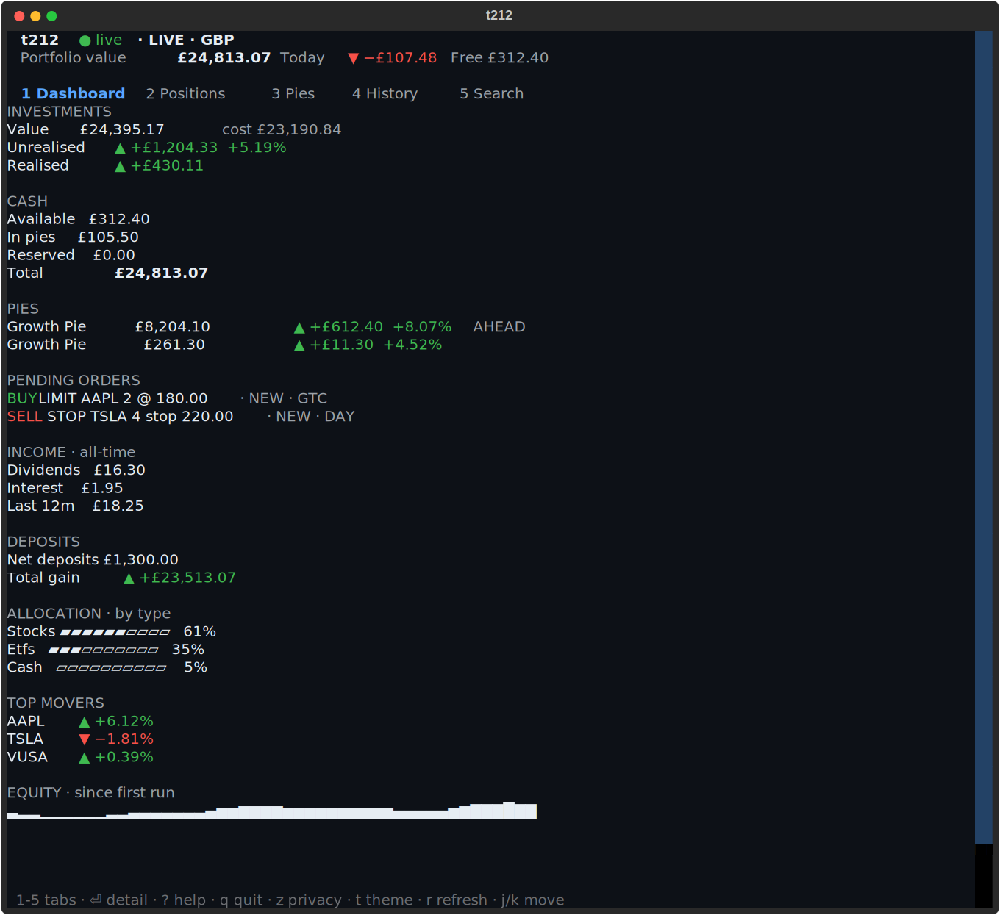
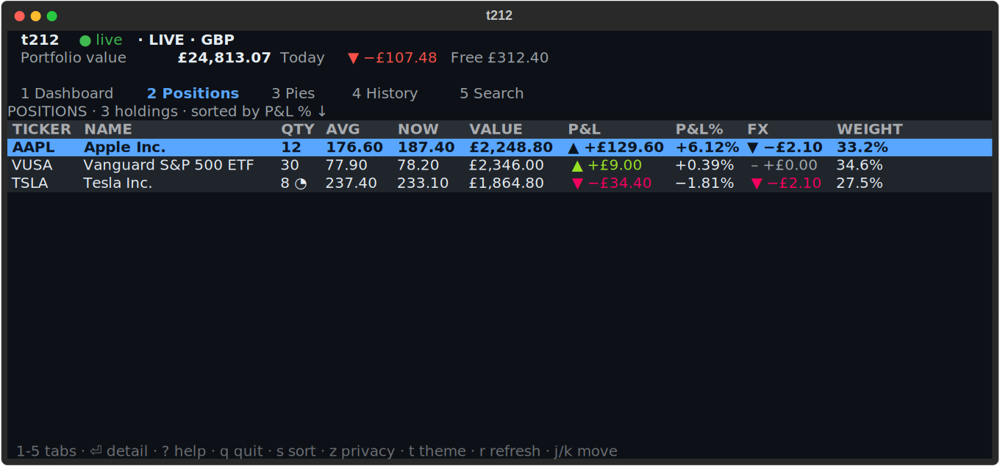
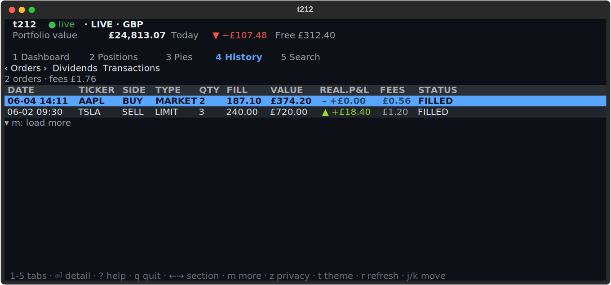
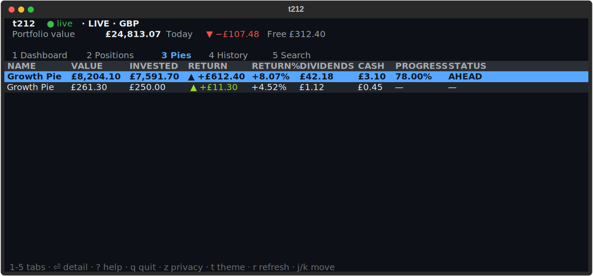
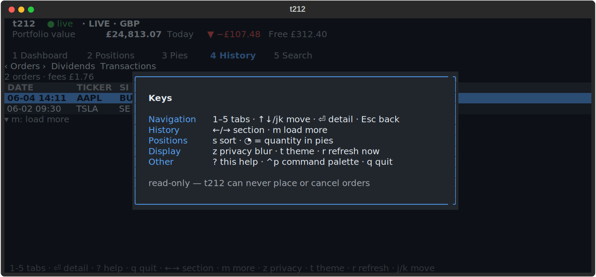

# t212

A terminal dashboard for your Trading 212 account. **Read-only by design** — it
can show you everything and touch nothing: the only HTTP verb in the client is
`GET`.



## Quick start

```sh
uvx t212-tui
```

That's it — first run opens a guided setup that validates your API key against
the live API before saving, or lets you browse sample data with no key at all.

Other ways to run it:

```sh
uv tool install t212-tui     # installs the `t212` command
pipx install t212-tui        # same, via pipx
pip install t212-tui         # plain pip
```

<details>
<summary>Getting an API key</summary>

Trading 212 app → **Settings → API (Beta)** → generate a key. Enable the read
scopes: Account, Portfolio, Pies, Metadata, History. *Orders read* is optional
(it powers the pending-orders panel). Works with Invest and Stocks ISA accounts.

You can also configure outside the TUI:

```sh
export TRADING212_API_KEY="<keyId>:<secret>"   # env var, or
t212 config set-key                            # prompt → saved chmod 600
```
</details>

## Screens

| | |
|---|---|
|  |  |
|  |  |

- **Dashboard** — value, unrealised/realised P&L, cash breakdown, pending
  orders, dividend & interest income, net deposits vs. current value,
  allocation, top movers, equity curve.
- **Positions** — sortable table with P&L, FX impact and weight; `◔` marks
  quantity held inside pies; detail view per holding.
- **Pies** — value, return, dividends and goal progress per AutoInvest pie;
  drill in for target-vs-actual drift and flagged instrument issues.
- **History** — orders with realised P&L and fees, dividends with running
  totals (cash interest included), transactions with running balance; `m`
  pages further back.
- **Search** — the full tradeable universe, filtered as you type, with market
  hours in the detail view.
- **Equity curve** — the API has no account-value history, so t212 records a
  local SQLite snapshot on each poll. The curve grows the longer you use it
  and is labelled *since first run*; nothing is back-filled.

Plus: three themes (`t`), privacy blur for screen-sharing (`z`), and
gains/losses always carry an arrow and sign — never colour alone.

## Commands & keys

```sh
t212              # live account
t212 --demo       # practice account
t212 --mock       # sample data, no key needed
t212 --once       # plain-text summary to stdout, then exit
t212 --refresh 15 # poll interval in seconds
```

| Key | Action | Key | Action |
| --- | --- | --- | --- |
| `1`–`5` | Switch tab | `s` | Sort (Positions) |
| `↑`/`↓` `j`/`k` | Move | `m` | Load more (History) |
| `Enter` / `Esc` | Open / close detail | `z` | Privacy blur |
| `←` `→` | History section | `t` | Theme |
| `r` | Refresh now | `?` | Help |

## How it behaves

- Talks to Trading 212's `/api/v0` endpoints with HTTP Basic
  `keyId:secret` auth.
- The API is REST-only, so data is polled — each endpoint on its own cadence
  within its documented rate limit, with jitter and automatic back-off on
  `429`. Only the active tab's data is fetched.
- Credentials live in `~/.config/t212/config.toml` (chmod 600), are sent
  nowhere except trading212.com, and are never logged or rendered. Snapshots
  are stored per account in `~/.local/share/t212/`.

## Development

```sh
uv sync
uv run pytest -q                       # 120 tests, fixture-driven, no network
uv run t212 --mock                     # full UI offline
uv run python scripts/screenshots.py  # regenerate README screenshots
```

```
src/t212/
  models.py     pydantic models for the API
  api/          client protocol · httpx client · mock client · rate limiter
  scheduler.py  per-tab polling
  store.py      sqlite snapshots + instrument cache
  app.py        Textual app shell
  screens/      dashboard · positions · pies · history · search · setup · details
  widgets/      header · tab bar · hint bar · render primitives
```

## Disclaimer

Unofficial, not affiliated with Trading 212. The API is in beta and may change.
Not financial advice; use at your own risk.

[MIT](LICENSE) © shadowhusky
